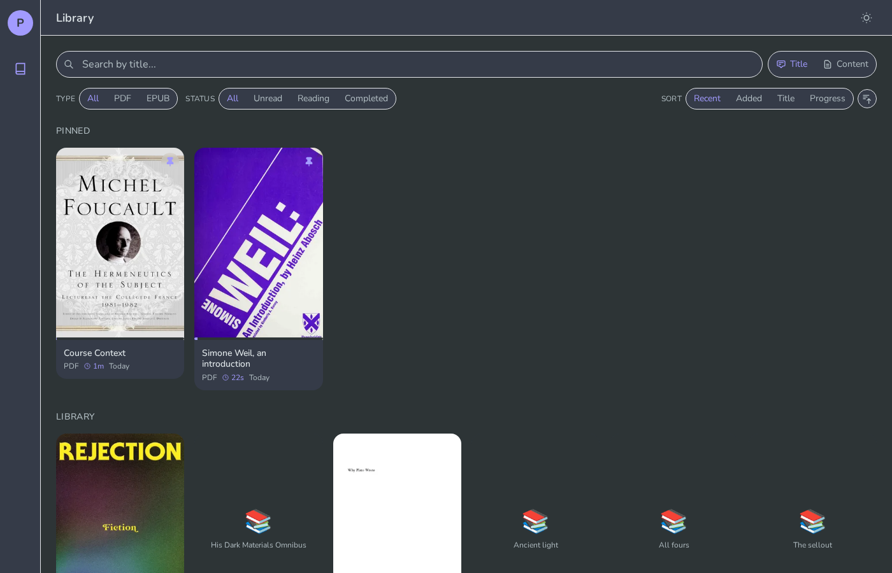
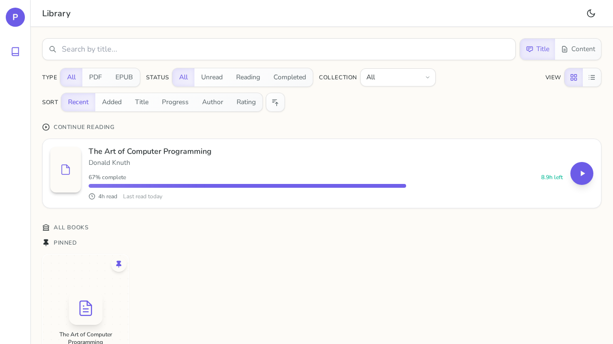
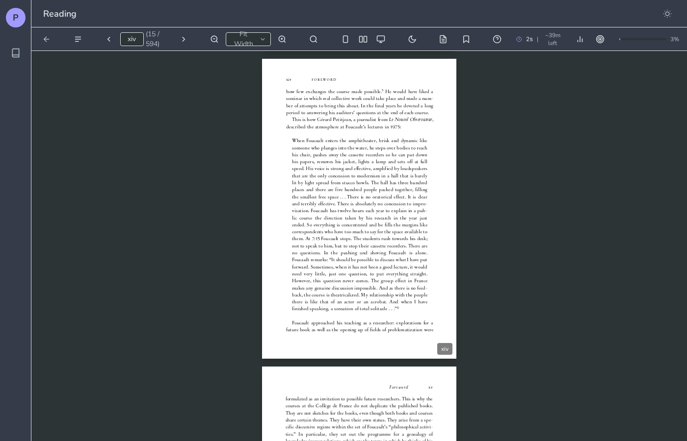

# Pulp

Self-hosted PDF and EPUB reader that syncs with Obsidian literature notes. Stores reading progress, highlights, and bookmarks in markdown frontmatter.

Works best with [BibLib](https://github.com/callumalpass/obsidian-biblib), an Obsidian plugin for managing literature notes with bibliographic metadata.

## Screenshots

### Library

<p>
  
</p>

<p>
  
</p>

### Reader

<p>
  
</p>

### Mobile

<p>
  
</p>

## Features

- PDF and EPUB reading with progress sync
- Highlights and bookmarks stored in frontmatter
- Full-text search across documents
- Reading statistics and daily goals
- Dictionary lookup
- E-ink display mode
- Server-triggered client document opens over WebSocket

## Requirements

- Node.js 20+
- A directory with markdown files linking to PDF/EPUB files

## Setup

Create `~/.config/pulp/config.yaml` (or set `PULP_CONFIG`):

```yaml
library_path: ~/path/to/literature-notes
source_key: source  # frontmatter key pointing to the PDF/EPUB file
```

## Development

```bash
npm install

# Start both servers
npm run dev:server  # http://localhost:3000
npm run dev:web     # http://localhost:5174
```

## Build

```bash
npm run build
npm start -w @pulp/server
```

## Remote Open Commands

Pulp can tell connected web clients to open a document from the server side.

`POST /api/commands/open-note`

Request body:

```json
{
  "noteId": "your-note-id",
  "page": 12,
  "cfi": "epubcfi(/6/2!/4/1:0)"
}
```

Notes:

- `noteId` is required and must refer to an existing literature note.
- `page` is optional and is used for PDF deep links.
- `cfi` is optional and is used for EPUB deep links.
- The command is broadcast to currently connected clients only.
- The browser can be navigated client-side, but Pulp cannot force the tab or window to take OS focus.

Example:

```bash
curl -X POST http://localhost:3000/api/commands/open-note \
  -H 'Content-Type: application/json' \
  -d '{"noteId":"my-note-id","page":3}'
```

## Reading Stats Storage

Reading stats are now computed from raw frontmatter records instead of being fully materialized into a persisted aggregate blob.

Notes:

- `reading_history` and `reading_sessions` are the primary source of truth.
- Pulp computes API-facing `readingStats` from those raw records on read.
- Existing legacy `reading_stats` data is still used as a migration fallback.
- New writes only persist stable metadata in `reading_stats` such as `first_read` and milestone records.
- Pulp no longer truncates `reading_history` or `reading_sessions`, because doing so would corrupt lifetime totals once aggregates are computed from raw data.

## Tests

```bash
npm run test:e2e
npm run typecheck
npm run lint
```

## Structure

```
packages/
├── server/   # Fastify API server
├── web/      # React frontend (Vite)
└── shared/   # TypeScript types
```
